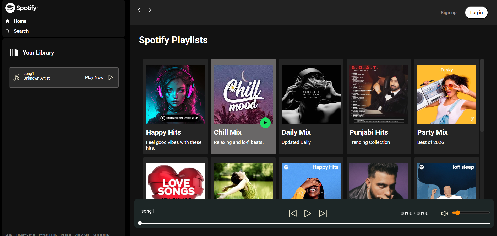

# Spotify Clone

A frontend clone of Spotify's UI built to practice HTML, CSS, and Vanilla JavaScript with responsive layouts and DOM manipulation.

## 🛠️ Tech Stack
- HTML5
- CSS3 (Vanilla)
- JavaScript (ES6+)

## 🔍 Preview

### Home / Browse


### Mobile View


## 🚀 Getting Started

```bash
git clone [repo-url]
cd [project-folder]
# No installation required! Just open index.html in your browser.
```

## 📌 Notes
This is a practice project built to strengthen frontend skills — not affiliated with or endorsed by Spotify.
